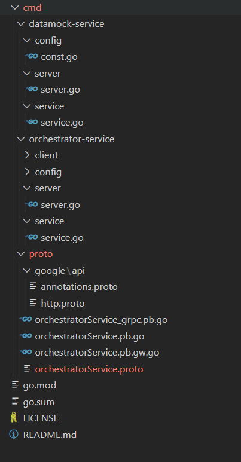
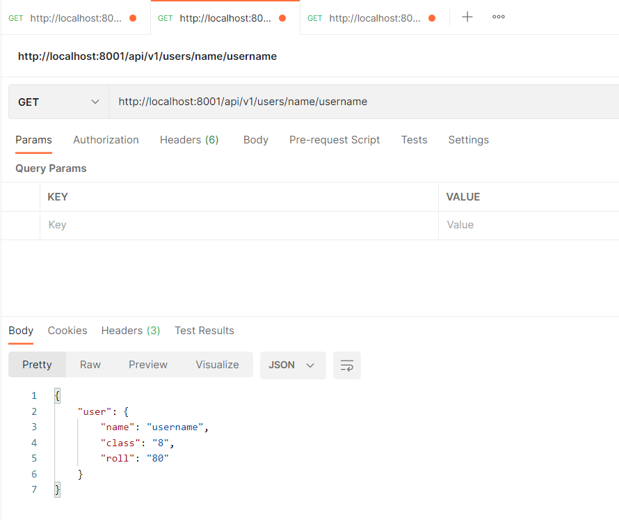
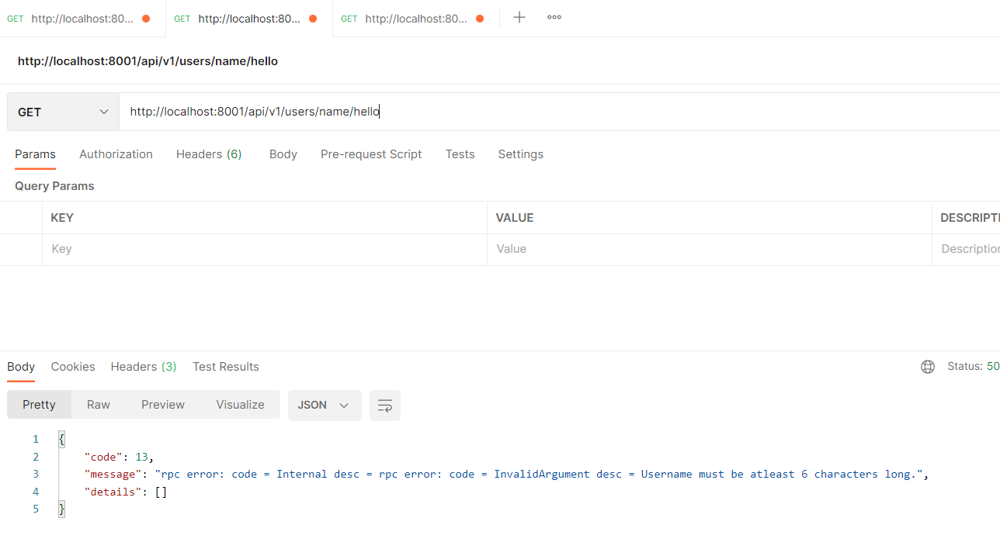
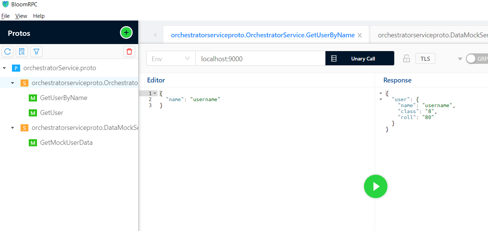
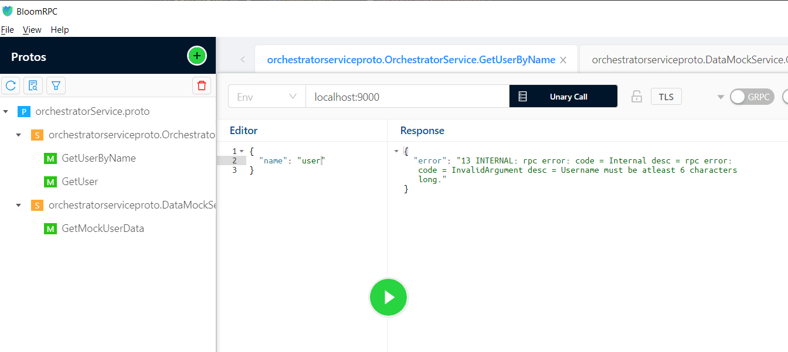

# Orchestrator Service - golang

## Prerequisites
+ golang
+ protoc compiler
+ Code Editor (for ex. VS Code)
+ Postman
+ BloomRPC

## About
- Operating System Used for Development: Windows
- GOPATH -> %USERPROFILE%\go
- This project includes two services: Orchestrator Service and DataMock Service.
- We have one model: User -> name:string, class:string, roll:int64 
- Methods on User Model:
    - GetUser: given a name of the user return the User by calling GetMockUserData
    - GetUserByName: given a name of the user return the User by calling GetUser
    - GetMockUserData: given a name of the user,
        - If length of name is < 6, then return an error.
        - Else return a User with:
        - name:<given name>, class:length(name), roll:length(name) * 10 
- Orchestrator service contains methods: GetUser, GetUserByName
- DataMock service contains methods: GetMockUserData
- All the communications between the services are through gRPC.
- Both the services supports REST as well as gRPC requests.

## Project Structure


### Description

> #### datamock-service & orchestrator-service directories
These two directories represents the two services of the project.

> #### config/const.go
This file contains all the constants used within the service.

> #### client/client.go
This file contains the functions to create a client of DataMock Service / Orchestrator Service.  

> #### server/server.go
This file contains functions to start/stop the REST as well as gRPC servers.

> ####  service/service.go
This file contains the implementation of service methods (GetUser, GetUserByName, GetMockUserData).

> #### proto directory
This directory constains the protobuf file, its dependencies (google/api/annotations.proto & google/api/http.proto) and go files generated by protoc compiler.

## Setup Locally

```
git clone https://github.com/meetpatel0963/orchestrator-service.git
```

> To get all the Go dependencies:
```
go mod download
```

> Execute all the commands shown below from the root of the project.

> To generate go files using protoc compiler:
```
cd ./cmd/proto
protoc -I . --grpc-gateway_out . --grpc-gateway_opt logtostderr=true --grpc-gateway_opt paths=source_relative --grpc-gateway_opt generate_unbound_methods=true orchestratorService.proto
protoc --go_out=paths=source_relative:. --go-grpc_out=paths=source_relative:. orchestratorService.proto
```

> Create required directories and files as per the project-structure shown above.

```
cd ./cmd/datamock-service/server
go run server.go
```

> Open a new terminal:
```
cd ./cmd/orchestrator-service/server
go run server.go
```

## Test Locally

> Once the servers are started, open Postman and BloomRPC to test both REST and gRPC support.
> Port Information for Services:
```
Orchestrator Instance 1: REST->8000 gRPC->9000
Orchestrator Instance 2: REST->8001 gRPC->9001
DataMock: REST->8002 gRPC->10000
```

> Postman:
- GetUser: http://localhost:8001/api/v1/users/<username>
- GetUserByName: http://localhost:8001/api/v1/users/name/<username> 
- GetMockUserData: http://localhost:8002/api/v1/users/data/<username>

> BloomRPC:
- Import /cmd/proto/orchestratorService.proto in BloomRPC and make calls to the methods.







